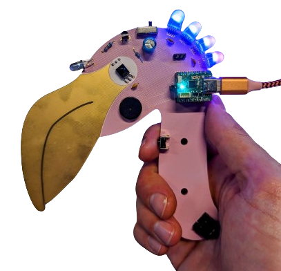

# Fri3dcamp blaster 2024

This repository contains the design files, production files and sources for the 2024 blaster as well as the sources for the 2022 blaster.

## Micropython Badge Driver
in Sources/Micropython you find the driver for the 2022/2024 Badge to communicate with the Blaster.

Features:
 - Receive IR packets
 - Send IR packets (if you have the Blaster SAO)
 - Send/Receive Link packets (link cable)
 - Control the blaster via Link packets

## 2024 Blaster
in Sources/2024_blaster. (WIP)

## 2022 Blaster
in Sources/2022_blaster

This blaster can be upgraded to be compatible with the 2024 blaster

The 2022 blaster can be upgraded with the new firmware in a few ways:
1) flash using USB. If your blaster has the USB UART chipt and a USB port then you can upload the new firmware using the Arduino IDE.
2) flash using a external USB to UART adapter.
3) flash using the 6 pin ISP header. You'll need an AVRISP mkII or compatible programming device. You can turn a regular arduino UNO into a ISP flasher.

Don't worry if you don't know how to do this or if you dont have the USB to UATY adapter/AVRISP. We will support you with this at Fri3d Camp.